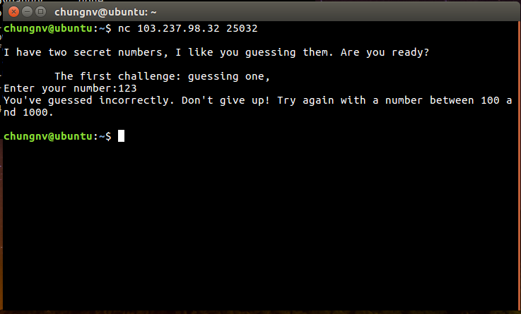
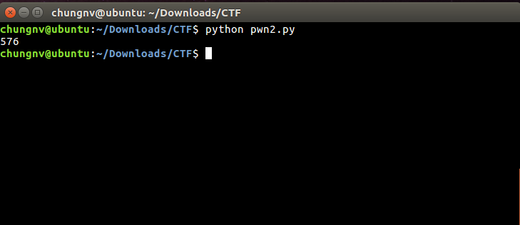
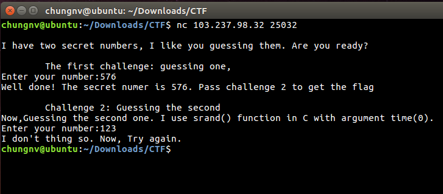

### Bài này trước tiên phải connect tới `nc 103.237.98.32 25032` xem là gì.



Ta thấy được chương trình yêu cầu nhập 2 số và số thứ nhất là nằm trong khoảng từ `100-1000`

```py
import socket

host = "103.237.98.32"
port = 25032

def request(ans):
	s = socket.socket()
	s.connect((host,port))
	s.recv(1024)
	s.recv(1024)
	s.send(str(ans)+'\n')
	return s.recv(1024)

def main():
	for i in range(100,1000):
		if "incorrectly" in request(i):
			continue
		else:
			print i
			break

if __name__ == '__main__':
	main()
```
Sử dụng đoạn `script-python` trên để tìm số nhập vào thỏa mãn bước thì giá trị cần tìm là `576`



### Nhập giá trị đầu tiên là 576 ta được thông tin như hình dưới đây:



Nhận thấy số thứ 2 sẽ được chương trình `random` bằng hàm `srand() trong C` với tham số `time(0)`
Sử dụng đoạn `script-python` sau để chạy tìm ra flag.
```py
import socket
from math import *
import time
from ctypes import CDLL
libc = CDLL('libc.so.6')

host = "103.237.98.32"
port = 25032


def request():
    s = socket.socket()
    s.connect((host,port))
    s.recv(1024)
    s.recv(1024)
    s.send(str(576)+'\n')
    s.recv(1024)
    s.recv(1024)
    now = int(floor(time.time()))
    libc.srand(now)
    random_num = libc.rand()
    s.send(str(random_num)+'\n')
    txt =  s.recv(1024)+s.recv(1024)
    return txt

def main():
	print "Attack..."
	check = True
	while check:
		ans = request()
		if "Flag is" in ans:
			print ans
			check = False
		else:
			print "Skip..."


if __name__ == '__main__':
    main()
```
Kết quả được: `Amazing !You are right. Flag is: Life_is_a_story_make_yours_the_best_seller.`
