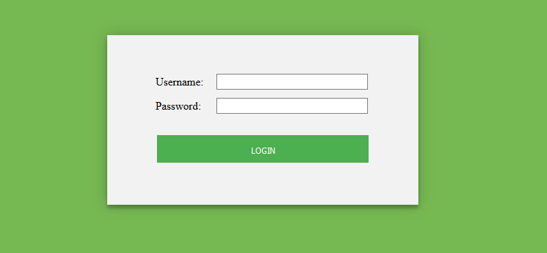
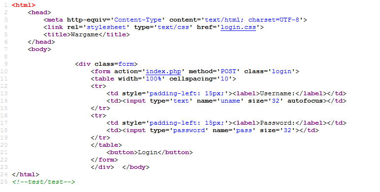
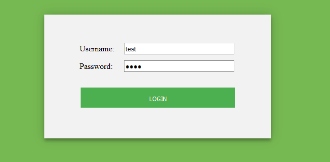
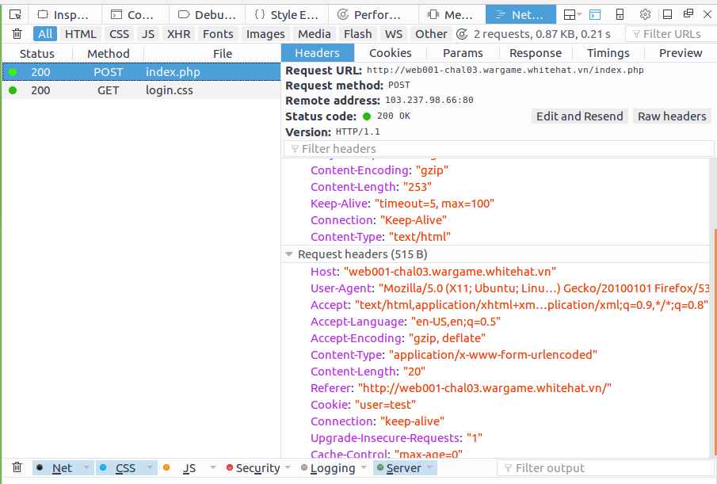
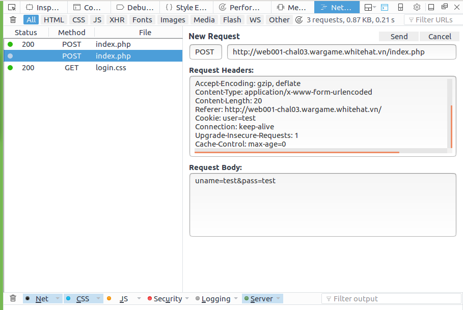
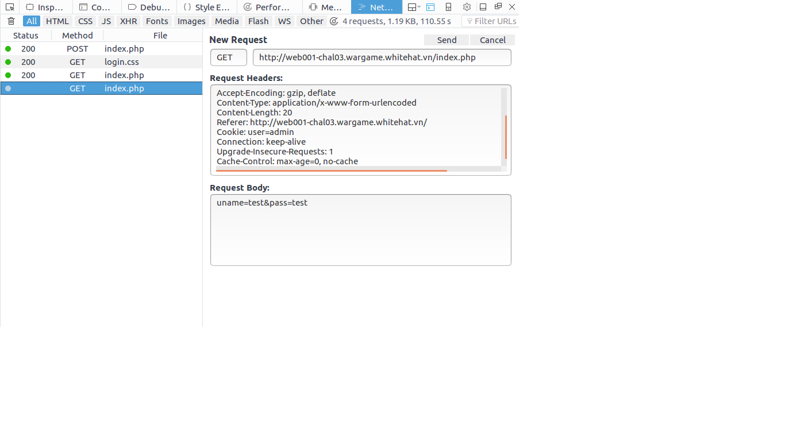
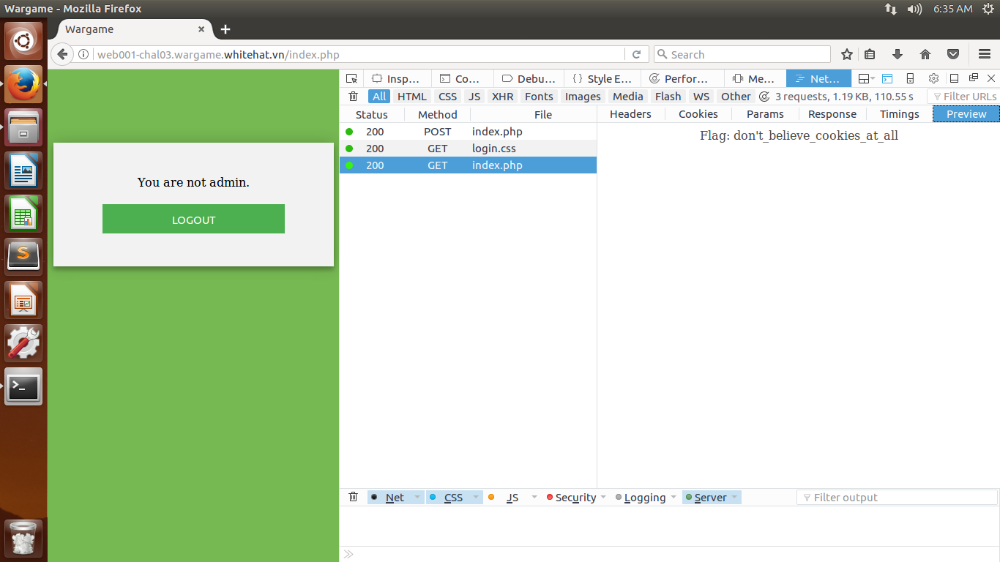

# Solve

# Using FireFox

Truy cập vào trang web ta thấy giao diện đăng nhập.

Với những dạng bài thế này ta nghĩ tới 2 phương hướng đó là dùng SQL injection hoặc dùng Cookie, view source ta thấy:

Ở cuối có dòng chú thích  `<!--test/test-->`, quay lại đăng nhập với user và mật khẩu là: `test`

Sau khi đăng nhập ấn `F12` mở tab Netword chọn `index.php`

Click vào `edit and resend` và sửa Cookie: `user = test` thành `user = admin` và sửa `POST` thành `GET`

and

Click vào `send` sau đó mở sang tab `preview` sẽ thấy flag:

