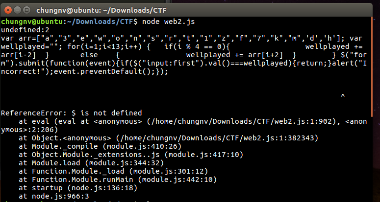

Truy cập vào địa chỉ web side ta thấy yêu cầu nhập mật khẩu.


Open source ta thấy một đoạn script. Copy đoạn script vất vào console

```js
console.log(+[]]+([..........+[]]+([]());
```
Chạy đoạn `script` trên thu được kết quả như sau:



Copy đoạn `script` vừa tìm được về chỉnh sửa ta được như sau:
```js
var arr=["a","3","e","w","o","n","s","r","t","1","z","f","7","k","m",'d','h']; 
var wellplayed=""; 
for(i=1;i<13;i++) {
 	if(i % 4 == 0){
  		wellplayed += arr[i-2]
   	}
   	else {
   		wellplayed += arr[i+2]
   	}
}
console.log(wellplayed)
```
Chạy đoạn `script` trên thu được password là: `wonert1sf7kz`

Nhập password vào trang ban đầu ta thu được kết quả: `Flag: easy_javascript_right?`
